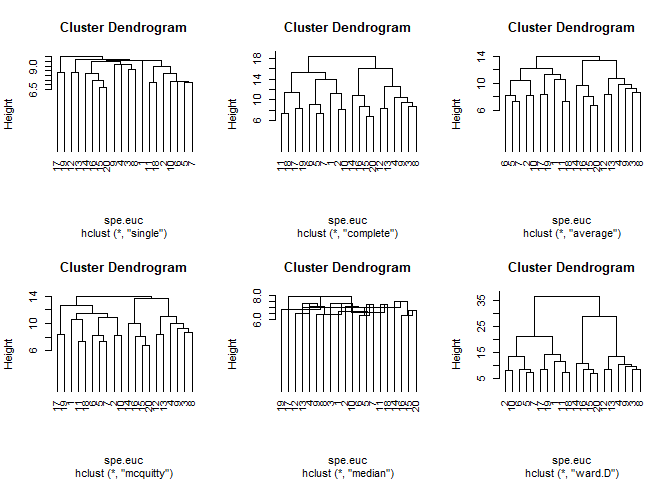
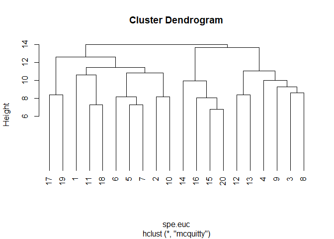
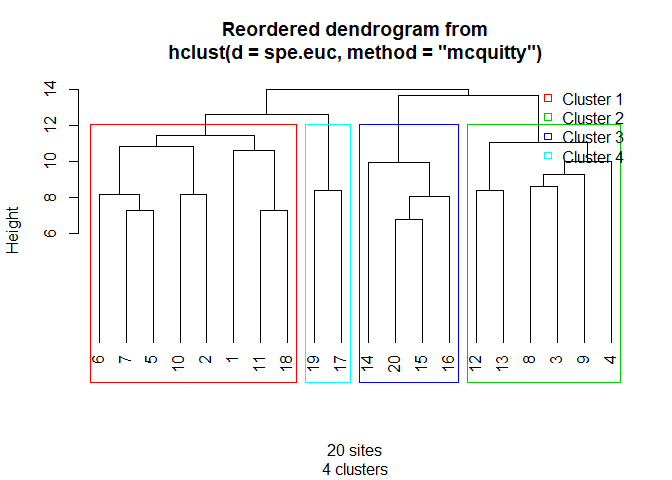

Análise de Agrupamento
================

A análise de agrupamento pretende classificar objetos com base em descritores. Aqui o termo objeto não ser refere aos objetos do R e sim o que você pretende classificar.

Podemos, por exemplo, querer classificar sítios distintos de acordo com a composição de espécies. Assim, as espécies em uma parcela descrevem como é a parcela e, portanto, parcelas com espécies semelhantes são mais parecidas e podem ser colocadas dentro de um mesmo grupo.

Para analisarmos dados com o objetivo de classificar/agrupar necessitamos de uma matrix de dados onde as linhas são os objetos a serem classificados e as colunas os descritores desses objetos.

Basicamente, o agrupamento consiste em analisar quais objetos são mais parecidos com quais, baseado em alguma medida de distância entre os objetos. Para isso, criamos uma matriz de distâncias par a par entre os objetos. É sobre essa matrix que faremos o agrupamento dos objetos.

Existem muitos métodos para realizar esse tipo de analise que podem ser agrupadas em hierárquicas e não-hierarquicas. Aqui focaremos na contrução de dendrogramas a partir de métodos hierárquicos de agrupamento.

A análise então seguirá alguns passos:

1 - Criar uma matrix de distãncias
2 - Realizar o agrupamento por diferentes métodos
3 - Escolher o método de agrupamento mais informativo
4 - Definir a linha de corte do dendrograma
5 - Gerar um gráfico (dendrograma) que mostre os grupos identificados pela análise

Pacotes necessários
-------------------

Nesta seção utilizaremos funções dos pacotes `vegan` e `cluster`, carregue essas bibliotecas. Caso alguma delas não esteja instalada utilize a função `install.packages`

``` r
# Pacotes
library(vegan)
```

    ## Loading required package: permute

    ## Loading required package: lattice

    ## This is vegan 2.4-3

``` r
library(cluster)
```

Passo 1 - Criar uma matrix de distâncias
----------------------------------------

Neste exemplo iremos utilizar os dados de `dune` representando a vegetação de dunas holandesas com 30 espécies descrevendo 20 sítios.

Para calcular a matriz de distâncias entre os sítios utilizamos a função `vegdist` do pacote vegan.

``` r
data("dune")
spe <- dune

spe.euc <- vegdist(spe, method = "euclidean")
```

Passo 2 - Realizar o agrupamento por diferentes métodos
-------------------------------------------------------

Há diferentes métodos propostos na literatura para realizar uma analise de agrupamento e cada método tende a apresentar um resultado diferente.

``` r
# Single linkage
spe.euc.single <- hclust(spe.euc , method="single")
# Complete-linkage agglomerative clustering
spe.euc.complete <- hclust(spe.euc , method="complete")
# UPGMA agglomerative clustering
spe.euc.UPGMA <- hclust(spe.euc , method="average")
# Compute WPGMA 
spe.euc.WPGMA <- hclust(spe.euc , method="mcquitty")
# Compute WPGMC 
spe.euc.WPGMC <- hclust(spe.euc , method="median")
# Ward's minimum variance clustering
spe.euc.ward <- hclust(spe.euc, method="ward.D")

op <- par()

par(mfrow = c(2,3))

plot(spe.euc.single, hang = -1, cex = 0.9)
plot(spe.euc.complete, hang = -1, cex = 0.9)
plot(spe.euc.UPGMA, hang = -1, cex = 0.9)
plot(spe.euc.WPGMA, hang = -1, cex = 0.9)
plot(spe.euc.WPGMC, hang = -1, cex = 0.9)
plot(spe.euc.ward, hang = -1, cex = 0.9)
```

 \#\# Passo 3 - Escolher o método de agrupamento mais informativo

Não há um método que seja melhor que outro, eles criam os agrupamentos de maneira diferente, e dessa maneira acabam perdendo informação em relação a real distância entre os sítios (contídos na matrix de distancias euclidianas).

Para contornar esse problema, podemos escolher um método de agrupamento com base no npivel de informação que é mantida no dendograma em relação à matriz de distâncias. Isso é feito por meio de correlação cofenética, onde o valor indica a percentagem de informação mantida no dendrograma em relação à matriz de distâncias. Escolhemos o método que apresentar o maior indice de correlação cofenética para seguir com a análise.

``` r
# Single linkage clustering
spe.euc.single.coph <- cophenetic(spe.euc.single)
cor(spe.euc, spe.euc.single.coph)
```

    ## [1] 0.5748702

``` r
# Complete linkage clustering
spe.euc.comp.coph <- cophenetic(spe.euc.complete)
cor(spe.euc, spe.euc.comp.coph)
```

    ## [1] 0.7095772

``` r
# Average clustering
spe.euc.UPGMA.coph <- cophenetic(spe.euc.UPGMA)
cor(spe.euc, spe.euc.UPGMA.coph)
```

    ## [1] 0.7241221

``` r
# WPGMA clustering
spe.euc.WPGMA.coph <- cophenetic(spe.euc.WPGMA)
cor(spe.euc, spe.euc.WPGMA.coph)
```

    ## [1] 0.7278302

``` r
# WPGMC clustering
spe.euc.WPGMC.coph <- cophenetic(spe.euc.WPGMC)
cor(spe.euc, spe.euc.WPGMC.coph)
```

    ## [1] 0.06025703

``` r
# Ward clustering
spe.euc.ward.coph <- cophenetic(spe.euc.ward)
cor(spe.euc, spe.euc.ward.coph)
```

    ## [1] 0.6906612

O método WPGMA obteve o maior valor de correlação cofenética e prosseguiremos a analise de agrupamento utilizando este método.

``` r
plot(spe.euc.WPGMA, hang = -1)
```



Passo 4 - Definir a linha de corte do dendrograma
-------------------------------------------------

Olhando o gráfico acima, quantos grupos foram formados?

Essa é geralmente uma decisão arbritrária, entretando há uma opção matemática para auxiliar nessa decisão: medir a Largura Média da Silhueta.

A largura da silhueta indica o nível de pertencimento de um objeto (sítio no nosso caso) a um grupo preestabelecido. Neste sentido, quanto maior for o valor melhor é o pertencimento de um objeto ao seu grupo, ou seja o agrupamento esta bem estabelecido. Assim, se a média da largura da silhueta for alta melhor é o agrupamento.

O código abaixo roda essa análise e nos retorna um gráfico que indica quantos grupos nossa linha de corte do dendrograma deve produzir

``` r
asw <- numeric(nrow(spe))
for (k in 2:(nrow(spe)-1)) {
  sil <- silhouette(cutree(spe.euc.WPGMA, k=k), spe.euc)
  asw[k] <- summary(sil)$avg.width
}
k.best <- which.max(asw)
windows(title="Silhouettes - WPGMA - k = 2 to n-1")
plot(1:nrow(spe), asw, type="h", 
     main="Silhouette-optimal number of clusters, UPGMA", 
     xlab="k (number of groups)", ylab="Average silhouette width")
axis(1, k.best, paste("optimum",k.best,sep="\n"), col="red", font=2,
     col.axis="red")
points(k.best, max(asw), pch=16, col="red", cex=1.5)
```


``` r
cat("", "Silhouette-optimal number of clusters k =", k.best, "\n", 
    "with an average silhouette width of", max(asw), "\n")
```

    ##  Silhouette-optimal number of clusters k = 4 
    ##  with an average silhouette width of 0.2063101

A analise indicou a presença de quatro grupos, resta produzir o dendrograma com esses grupos

Passo 5 - Gerar um gráfico (dendrograma) que mostre os grupos identificados pela análise
----------------------------------------------------------------------------------------

Para gerar esse gráfico vamos utilizar uma função criada `hcoplot`por Legendre & Legendre 2008 **\[BAIXE AQUI\]**. Baixe o script da função para a pasta de trabalho do R. Quando uma função está dentro de um scrit podemos usar `source`para carregar a função sem abrir o script. Você também pode abrir o script e rodar tudo que funciona do mesmo jeito.

Nesta função exige os o objeto do tipo `hclust`

``` r
source("hcoplot.R")

hcoplot(spe.euc.WPGMA, spe.euc, k = 4)
```

    ## Loading required package: gclus


