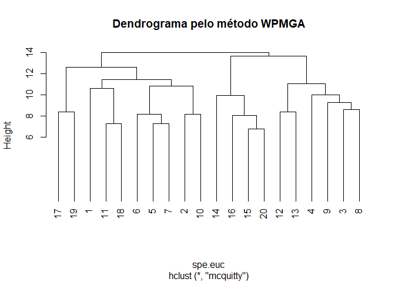
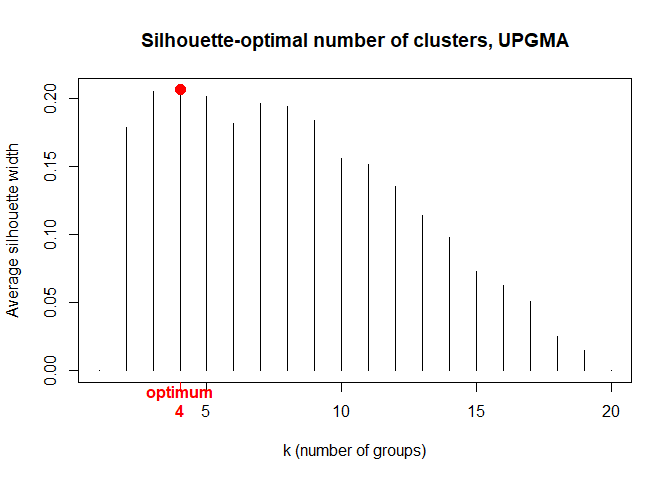
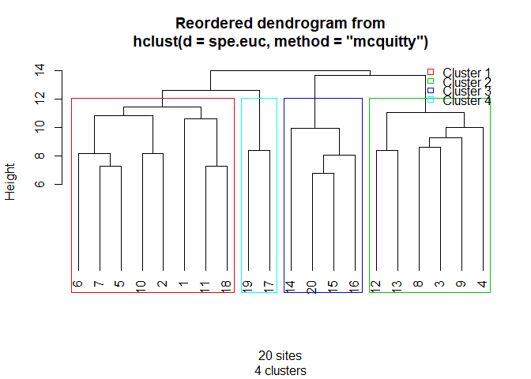

Análise de Agrupamento
================

A análise de agrupamento pretende classificar objetos com base em descritores. Aqui, o termo objeto não se refere aos objetos do R e sim o que você pretende classificar.

Podemos, por exemplo, querer classificar sítios distintos de acordo com a composição de espécies. Assim, as espécies em uma parcela descrevem como é a parcela e, portanto, parcelas com espécies semelhantes são mais parecidas e podem ser colocadas dentro de um mesmo grupo.

Para analisarmos dados com o objetivo de classificar/agrupar necessitamos de uma matriz de dados onde as linhas referem-se aos objetos a serem classificados e as colunas aos descritores desses objetos.

Basicamente, o agrupamento consiste em analisar quais objetos são mais parecidos com quais, baseado em alguma medida de distância (dsitância euclidiana, por exemplo) entre os objetos, que pode ser entendida como o grau de diferença entre os objetos. Para isso, criamos uma matriz de distâncias par a par entre os objetos. É sobre essa matriz que faremos o agrupamento dos objetos.

Existem muitos métodos para realizar esse tipo de análise que podem ser agrupadas em hierárquicas e não-hierarquicas. Mas aqui focaremos apenas na construção de dendrogramas a partir de métodos hierárquicos de agrupamento.

O agrupamento então seguirá alguns passos:

1 - Criar uma matriz de distãncias
2 - Realizar o agrupamento por diferentes métodos
3 - Escolher o método de agrupamento mais informativo
4 - Definir a linha de corte do dendrograma
5 - Gerar um gráfico (dendrograma) com os grupos identificados

Pacotes necessários
-------------------

Nesta seção utilizaremos funções dos pacotes `vegan` e `cluster`. Carregue essas bibliotecas (com `library`). Caso alguma biblioteca não esteja instalada utilize a função `install.packages`.

``` r
# Pacotes
library(vegan)
library(cluster)
```

Passo 1 - Criar uma matriz de distâncias
----------------------------------------

Neste exemplo, iremos utilizar os dados de `dune` representando a vegetação de dunas holandesas com 30 espécies que descrevem 20 sítios.

Vamos calcular uma matriz de distâncias euclidianas entre os sítios utilizando a função `vegdist` do pacote vegan. Para outras medidas de distância veja o help da função (`?vegdist`).

``` r
data("dune")
spe <- dune

spe.euc <- vegdist(spe, method = "euclidean")
```

Passo 2 - Realizar o agrupamento por diferentes métodos
-------------------------------------------------------

Há diferentes métodos propostos na literatura para realizar analises de agrupamento e cada método tende a apresentar um resultado diferente.

Observe os gráficos:

``` r
### Criando os objetos de dendrograma
###

# Single linkage
spe.euc.single <- hclust(spe.euc , method="single")
# Complete-linkage agglomerative clustering
spe.euc.complete <- hclust(spe.euc , method="complete")
# UPGMA agglomerative clustering
spe.euc.UPGMA <- hclust(spe.euc , method="average")
# Compute WPGMA 
spe.euc.WPGMA <- hclust(spe.euc , method="mcquitty")
# Compute WPGMC 
spe.euc.WPGMC <- hclust(spe.euc , method="median")
# Ward's minimum variance clustering
spe.euc.ward <- hclust(spe.euc, method="ward.D")

# Plota os 6 dendrogramas em uma unica imagem
par(mfrow = c(2,3))

plot(spe.euc.single, hang = -1, cex = 0.9)
plot(spe.euc.complete, hang = -1, cex = 0.9)
plot(spe.euc.UPGMA, hang = -1, cex = 0.9)
plot(spe.euc.WPGMA, hang = -1, cex = 0.9)
plot(spe.euc.WPGMC, hang = -1, cex = 0.9)
plot(spe.euc.ward, hang = -1, cex = 0.9)
```


Passo 3 - Escolher o método de agrupamento mais informativo
-----------------------------------------------------------

Não há um método que seja melhor que outro, eles apenas agrupam os objetos de maneiras diferentes. Existem tantos métodos, porque nenhum deles consegue representar de maneira fiel as distâncias contidas na matriz de distâncias. Dessa maneira acabam perdendo informação em relação a real distância entre os sítios (distâncias euclidianas, no nosso exemplo).

Para contornar esse problema, podemos escolher um método de agrupamento com base no nível de informação que é mantida no dendograma em relação à matriz de distâncias. Isso é feito por meio de correlação cofenética, onde o valor indica a percentagem de informação mantida no dendrograma em relação à matriz de distâncias. Os valores de correlação cofenética variam entre 0 e 1 e quanto maior o indice de correlação cofenética mais informação foi mantida no dendrograma.

``` r
# Single linkage clustering
spe.euc.single.coph <- cophenetic(spe.euc.single)
cor(spe.euc, spe.euc.single.coph)
```

    ## [1] 0.5748702

``` r
# Complete linkage clustering
spe.euc.comp.coph <- cophenetic(spe.euc.complete)
cor(spe.euc, spe.euc.comp.coph)
```

    ## [1] 0.7095772

``` r
# Average clustering
spe.euc.UPGMA.coph <- cophenetic(spe.euc.UPGMA)
cor(spe.euc, spe.euc.UPGMA.coph)
```

    ## [1] 0.7241221

``` r
# WPGMA clustering
spe.euc.WPGMA.coph <- cophenetic(spe.euc.WPGMA)
cor(spe.euc, spe.euc.WPGMA.coph)
```

    ## [1] 0.7278302

``` r
# WPGMC clustering
spe.euc.WPGMC.coph <- cophenetic(spe.euc.WPGMC)
cor(spe.euc, spe.euc.WPGMC.coph)
```

    ## [1] 0.06025703

``` r
# Ward clustering
spe.euc.ward.coph <- cophenetic(spe.euc.ward)
cor(spe.euc, spe.euc.ward.coph)
```

    ## [1] 0.6906612

O método WPGMA obteve o maior valor de correlação cofenética e prosseguiremos a análise de agrupamento utilizando este método.

``` r
plot(spe.euc.WPGMA, hang = -1, main = "Dendrograma pelo método WPMGA")
```



Passo 4 - Definir a linha de corte do dendrograma
-------------------------------------------------

Olhando o gráfico acima, quantos grupos foram formados? Você arrisca?

Essa é geralmente uma decisão arbitrária. Entretanto há uma opção matemática para auxiliar nessa decisão: medir a Largura Média da Silhueta.

A largura da silhueta indica o nível de pertencimento de um objeto (sítio no nosso caso) a um grupo preestabelecido. Neste sentido, quanto maior for o valor melhor é o pertencimento de um objeto ao seu grupo, ou seja, o agrupamento esta bem estabelecido. Assim, se a média da largura da silhueta for alta melhor é o agrupamento geral.

O código abaixo roda essa análise e nos retorna um gráfico que indica quantos grupos nossa linha de corte do dendrograma deve produzir.

``` r
## Escolha do número de grupos pelo metodo de Largura Média da Silhueta
## 

asw <- numeric(nrow(spe))
for (k in 2:(nrow(spe)-1)) {
  sil <- silhouette(cutree(spe.euc.WPGMA, k=k), spe.euc)
  asw[k] <- summary(sil)$avg.width
}
k.best <- which.max(asw)
windows(title="Silhouettes - WPGMA - k = 2 to n-1")
plot(1:nrow(spe), asw, type="h", 
     main="Silhouette-optimal number of clusters, UPGMA", 
     xlab="k (number of groups)", ylab="Average silhouette width")
axis(1, k.best, paste("optimum",k.best,sep="\n"), col="red", font=2,
     col.axis="red")
points(k.best, max(asw), pch=16, col="red", cex=1.5)
```



``` r
cat("", "Silhouette-optimal number of clusters k =", k.best, "\n", 
    "with an average silhouette width of", max(asw), "\n")
```

    ##  Silhouette-optimal number of clusters k = 4 
    ##  with an average silhouette width of 0.2063101

A análise indicou a presença de quatro grupos, resta produzir o dendrograma com esses grupos.

Passo 5 - Gerar um gráfico (dendrograma) que mostre os grupos identificados pela análise
----------------------------------------------------------------------------------------

Para gerar esse gráfico vamos utilizar uma função criada `hcoplot`por Bocard el al (2011) \[**[baixe aqui](hcoplot.R)**\]. Baixe o script da função para a pasta de trabalho do R. Quando uma função está dentro de um scrit podemos usar `source`para carregar a função sem abrir o script. Você também pode abrir o script e rodar tudo que funciona do mesmo jeito.

A função funciona asssim:
`hcoplot(dendrograma, distâncias, k = número de grupos)`

A função `windows` será usada para gerar o gráfico em uma janela nova. Selecione as duas linhas e execute o código.

``` r
source("hcoplot.R")

windows()
hcoplot(spe.euc.WPGMA, spe.euc, k = 4)
```



Referência
----------

Borcard, D., Gillet, F., Legendre, P., 2011. Numerical Ecology with R. Springer.
