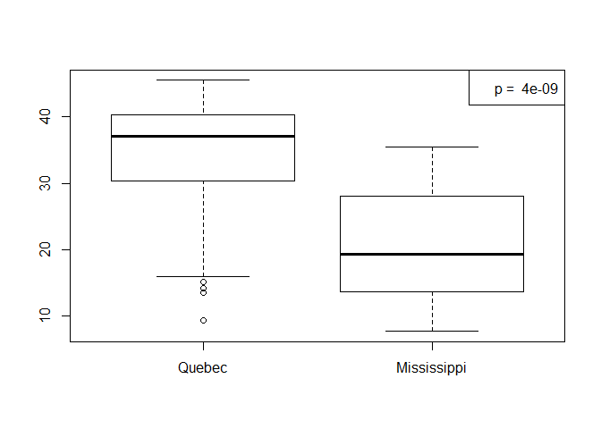
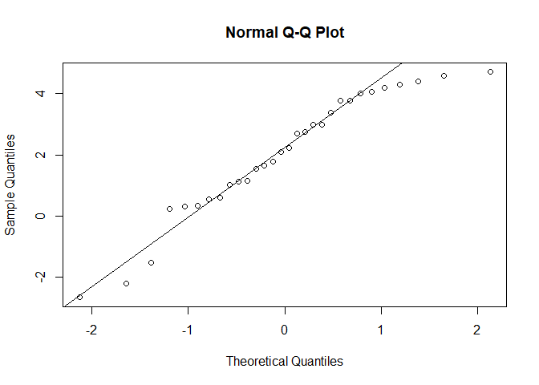
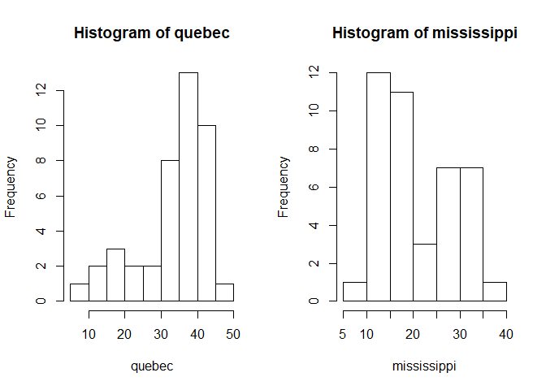
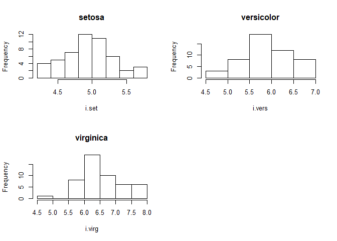
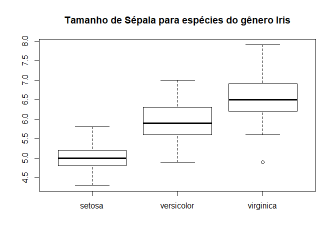
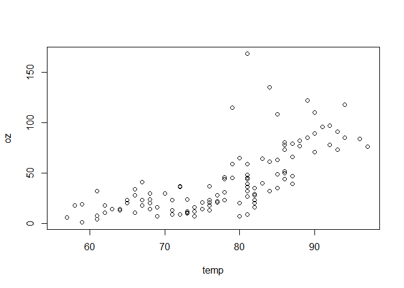
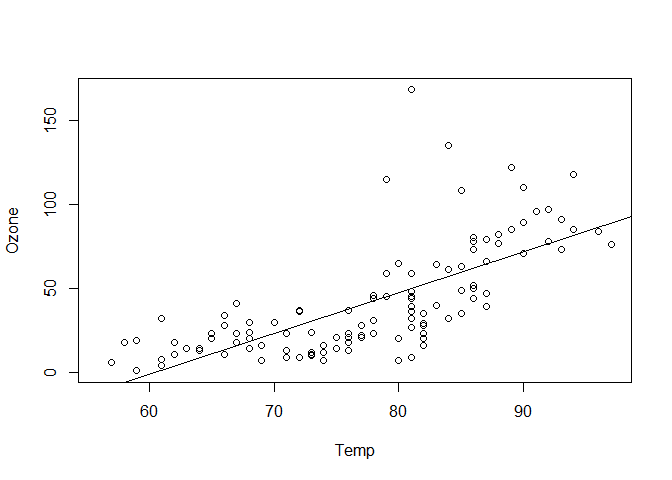
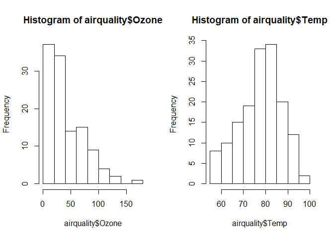
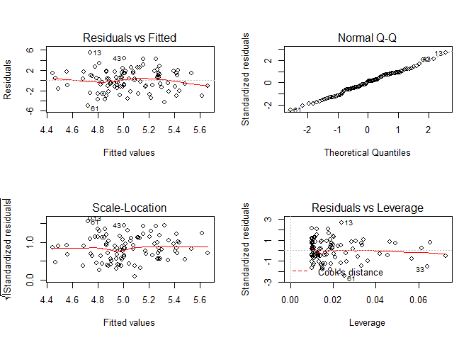
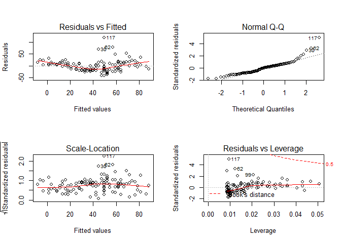

Estatística básica
================

Teste de Hipótese
=================

Em estudos de ecologia frequentemente desejamos fazer comparações entre diferentes grupos ou populações ou ainda verificar como as variáveis ambientais se relacionam com os organismos. Fazemos observações, coletamos dados, verificamos padrões e testamos se nossas ideias correspondem as nossas hipóteses.

Esses testes são baseados em uma lógica que assume que os eventos do mundo real são aleatórios. Se nossas observações são diferentes do esperado (ser aleatório) consideramos isso uma evidência de que os eventos analisados não são aleatórios e, especificamente para o que estamos testando, podemos afirmar que existe uma relação, ou efeito, ou diferença.

Em estatística, H0 (hipótese nula) representa a hipótese de que o mundo é aleatório e H1 a hipótese de que há relação, ou efeito, ou diferença, entre os fatores que foram observados.

Tudo é testado em termos de probabilidade, e o valor de p mede quais são as nossas chances de errar quando afirmamos que H1 é verdadeira. Então, um valor de p de 0,05, significa que temos 5% de chance de errar com essa afirmativa, um avalor aceitavel dentro do meio biótico.

Existem testes diferentes de acordo com o tipo de pergunta que você deseja responder. Se você está interessado nas diferenças entre grupos em relação a uma variável você deverá utilizar um teste para dados categóricos, como teste T e ANOVA. Se o seu interesse é na relação entre duas variáveis, você deve utilizar testes para dados contínuos, como correlação e regressão. Veja a figura:

**(adicionar figura)**

Além disso, esses testes ainda podem ser divididos entre os paramétricos e os não-paramétricos.

Testes paramétricos assumem uma disposição dos dados, e os testes realizados precisam atender a algumas condições para que você possa confiar no valor de p. Geralmente, nos testes paramétricos é exigido que os dados tenham distribuição normal e que a variância seja homogênea (conhecida também com homogeneidade ou homocedasticidade).

Nos testes não-paramétricos não precisamos atender aos pressupostos de normalidade e homogeneidade, porém nesses testes há uma maior dificuldade chegarmos a valores de p baixos para amostragens pequenas, acabando sendo menos confiáveis para esse tipo de dado.

No entanto, dados ecológicos dificilmente atendem a todos os pressupostos exigidos pelos testes paramétricos, e em alguns casos violar alguma dessas condições, como a normalidade dos dados pode não ser tão grave assim se você tiver um n-amostral alto. Há muitos bons livros disponíveis que tratam tanto de estatística, como de estatística voltada as questões ecológicas. Nestes livros você pode encontrar detalhes de como escolher o melhor método para a sua questão e o que implica escolher um ou outro método.

Aqui pretendo mostrar algumas funções do R que realizam testes de hipótese e algumas ferramentas utilizadas para verificar os pressupostos dos testes paramétricos.

Teste T
-------

O teste T é conduzido no R com a função `t.test`.

Para exemplificar, vamos utilizar os dados de captura de CO2 da por *Echinochloa crus-galli* e comparar de acordo com a origem da planta.

``` r
# carregue os dados
data("CO2")
```

Antes de aplicar o teste T, devemos saber se há homegeneidade das variâncias. Para isso, aplicamos a função `leveneTest` do pacote `car`. É necessário informar uma argumento do tipo formula escrita como `(variável ~ grupos)`.

``` r
library(car)
## Os dois códigos retoram o mesmo valor

#leveneTest(CO2$uptake ~ CO2$Type)
leveneTest(uptake ~ Type, data = CO2)
```

    ## Levene's Test for Homogeneity of Variance (center = median)
    ##       Df F value Pr(>F)
    ## group  1  0.1704 0.6808
    ##       82

No resultado acima `Pr(>F)` refere-se ao valor de p. Caso for significativo, abaixo de 0,05, consideramos que NÃO há homogeneidade das variâncias.

Como nossos dados possem variâncias homogêneas, devemos incluir o argumento `var.equal = TRUE` na função `t.test`. Caso contrário, não há necessidade de informar o argumento `var.equal`

``` r
t <- t.test(CO2$uptake ~ CO2$Type, var.equal = TRUE)
t
```

    ## 
    ##  Two Sample t-test
    ## 
    ## data:  CO2$uptake by CO2$Type
    ## t = 6.5969, df = 82, p-value = 3.835e-09
    ## alternative hypothesis: true difference in means is not equal to 0
    ## 95 percent confidence interval:
    ##   8.84200 16.47705
    ## sample estimates:
    ##      mean in group Quebec mean in group Mississippi 
    ##                  33.54286                  20.88333

O teste nos mostrou que temos diferenças na captura de CO2 entre os locais. Vamos visualizar os dados com um boxplot. E adicionamos uma legenda para informar os resultados do teste T.

Quando criamos um objeto com o resultado de um teste estatístico podemos ter acesso as informações sobre os resultados. Esses resultados são guardados em forma de lista em um objeto, e podemos acessar valor de p e intervalo de confiança, por exemplo, através desse objeto.

``` r
# Valor de p
t$p.value
```

    ## [1] 3.834686e-09

``` r
boxplot(CO2$uptake ~ CO2$Type)
legend("topright", paste("p = ",round(t$p.value,9)))
```



Outro pressuposto é que os dados devem ter distribuição normal. Podemos verificar graficamente se os dados atendem a esse pressuposto com um histograma, para efeito de comparação osbserve os histogramas com dados distribuição normal e não-normal.

``` r
set.seed(152)
normal <- rnorm(30, 2,2) 
nao.normal <- runif(30, -4, 4)

op <- par()

par(mfrow = c(1,2))

hist(normal)
hist(nao.normal)
```



Devemos verificar a normalidade dos dados de cada grupo comparado.

``` r
quebec <- CO2$uptake[CO2$Type == "Quebec"]
mississippi <- CO2$uptake[CO2$Type == "Mississippi"]

par(mfrow = c(1,2))

hist(quebec)
hist(mississippi)
```



Esses histogramas nada se parecem com o padrão de uma distribuição normal. Apenas com a visualização podemos afirmar que os dados violam o pressuposto de normalidade, ainda assim, podemos ainda testar a hipótese de os dados seguirem a distribuição normal pelo teste de Shapiro-Wilk. Neste teste, esperamos que a hipótese nula é que os dados são normais, ou seja, baixos valores de p indicam que os dados não são normais.

``` r
shapiro.test(quebec)
```

    ## 
    ##  Shapiro-Wilk normality test
    ## 
    ## data:  quebec
    ## W = 0.85988, p-value = 0.0001111

``` r
shapiro.test(mississippi)
```

    ## 
    ##  Shapiro-Wilk normality test
    ## 
    ## data:  mississippi
    ## W = 0.93633, p-value = 0.0213

Como visto nos histogramas, os testes confirmam que nossos dados não seguem uma distribuição normal, e portanto não podemos confiar no resultado do teste-t, pois o pressuposto de normalidade dos dados não foi atendido.

Teste Wilcoxon-Mann-Whitney
---------------------------

Confiar no resultado de um teste paramétrico que não atente os pressupostos aumenta a nossa chance de cometermos erro do tipo I (afirmamos existir diferença quando ela não existe).

A opção não-paramétrica para amostras independentes é o teste de Wilcoxon-Mann-Whitney (função `wilcox.test`), onde não precisamos assumir que os dados possuem distribuição normal.

``` r
wilcox.test(uptake ~ Type, data = CO2)
```

    ## Warning in wilcox.test.default(x = c(16, 30.4, 34.8, 37.2, 35.3, 39.2,
    ## 39.7, : cannot compute exact p-value with ties

    ## 
    ##  Wilcoxon rank sum test with continuity correction
    ## 
    ## data:  uptake by Type
    ## W = 1489, p-value = 5.759e-08
    ## alternative hypothesis: true location shift is not equal to 0

O teste confirma que há diferenças entre na captura de CO2 entre as populações de Quebec e Mississippi.

Neste caso, apesar dos dados violarem o pressuposto de normalidade o resultado do teste T foi confirmado pelo teste não-paramétrico.

ANOVA
-----

Enquanto o teste T verifica se há diferença da média de um parâmetro entre dois grupos, com a ANOVA podemos testar se há diferenças entre três ou mais grupos.

A ANOVA pressupõe que os dados têm distribuição normal, possuem variâncias homogêneas e que as amostras são independentes.

Como exemplo, vamos usar os dados de `iris` e testar se há diferenças de comprimento de sépalas entre as espécies.

``` r
data("iris")

str(iris)
```

    ## 'data.frame':    150 obs. of  5 variables:
    ##  $ Sepal.Length: num  5.1 4.9 4.7 4.6 5 5.4 4.6 5 4.4 4.9 ...
    ##  $ Sepal.Width : num  3.5 3 3.2 3.1 3.6 3.9 3.4 3.4 2.9 3.1 ...
    ##  $ Petal.Length: num  1.4 1.4 1.3 1.5 1.4 1.7 1.4 1.5 1.4 1.5 ...
    ##  $ Petal.Width : num  0.2 0.2 0.2 0.2 0.2 0.4 0.3 0.2 0.2 0.1 ...
    ##  $ Species     : Factor w/ 3 levels "setosa","versicolor",..: 1 1 1 1 1 1 1 1 1 1 ...

``` r
levels(iris$Species) # as espécies de iris
```

    ## [1] "setosa"     "versicolor" "virginica"

Antes verificamos se os dados da variável sépala seguem distribuição normal

``` r
# dados de comprimento de sepala para cada espécie

i.set <- iris[iris$Species == "setosa", "Sepal.Length"]
i.vers <- iris[iris$Species == "versicolor", "Sepal.Length"]
i.virg <- iris[iris$Species == "virginica", "Sepal.Length"]

# Histogramas
par(mfrow = c(2,2))

hist(i.set, main = "setosa")
hist(i.vers, main = "versicolor")
hist(i.virg, main = "virginica")
```



Fica claro que os dados atendem ao pressuposto de normalidade.

Vamos testar se eles possuem variâncias homogêneas com `leveneTest`

``` r
leveneTest(Sepal.Length ~ Species, data = iris)
```

    ## Levene's Test for Homogeneity of Variance (center = median)
    ##        Df F value   Pr(>F)   
    ## group   2  6.3527 0.002259 **
    ##       147                    
    ## ---
    ## Signif. codes:  0 '***' 0.001 '**' 0.01 '*' 0.05 '.' 0.1 ' ' 1

O teste indicou que as variâncias são heterogêneas e violam o pressuposto de homogeneidade.

Ainda assim, vamos conduzir o teste da ANOVA:

``` r
res <- aov(Sepal.Length ~ Species, data = iris)
summary(res)
```

    ##              Df Sum Sq Mean Sq F value Pr(>F)    
    ## Species       2  63.21  31.606   119.3 <2e-16 ***
    ## Residuals   147  38.96   0.265                   
    ## ---
    ## Signif. codes:  0 '***' 0.001 '**' 0.01 '*' 0.05 '.' 0.1 ' ' 1

Verificamos o resultado da ANOVA com a função `summary`. Novamente `Pr(>F)` indica o valor de p, neste caso um valor muito próximo a zero. A hipótese nula é rejeitada, porém, sabemos que violamos a condição de homogeneidade dos dados.

Esse teste mostrou apenas que existe diferença de comprimento de sépala entre pelo menos duas espécies, mas não sabemos quais.

O teste a posteriori de Tukey pode nos indicar quais espécies são diferentes de quais. Usamos a função `tukeyHSD` que exige um objeto com o resultado da ANOVA.

``` r
TukeyHSD(res)
```

    ##   Tukey multiple comparisons of means
    ##     95% family-wise confidence level
    ## 
    ## Fit: aov(formula = Sepal.Length ~ Species, data = iris)
    ## 
    ## $Species
    ##                       diff       lwr       upr p adj
    ## versicolor-setosa    0.930 0.6862273 1.1737727     0
    ## virginica-setosa     1.582 1.3382273 1.8257727     0
    ## virginica-versicolor 0.652 0.4082273 0.8957727     0

O resultado deste teste mostra as comparações par a par, exibindo na coluna `diff` as diferenças entre as medias, `lwr` a diferença mais baixa, `upr` maior diferença e `p adj` o valor de p.

Neste caso, o teste de Tukey revelou que todas as espécies diferem entre si em comprimento de sépala.

Vamos criar um boxplot para visualizar graficamente as diferenças em tamanho de sépala entre as espécies

``` r
boxplot(Sepal.Length ~ Species, data = iris, main = "Tamanho de Sépala para espécies do gênero Iris")
```



Teste de Kruskal-Wallis
-----------------------

Através do Teste de Kruskal-Wallis testamos se há diferenças de uma variável entre 3 ou mais grupos sem que os dados necessitem seguir uma distribuição normal.

``` r
kruskal.test(Sepal.Length ~ Species, data = iris)
```

    ## 
    ##  Kruskal-Wallis rank sum test
    ## 
    ## data:  Sepal.Length by Species
    ## Kruskal-Wallis chi-squared = 96.937, df = 2, p-value < 2.2e-16

Correlação linear
-----------------

Testes de correlação verificam se duas variáveis contínuas estão correlacionadas. A função `cor.test` realiza esse teste no R. O pressuposto aqui é que correlação é linear, se existir uma correlação porém não-linear esse teste não é capaz de identificar.

Como exemplo vamos utilizar os dados de `airquality` para testar se temperatura e concentração de ozônio estão correlacionadas linearmente.

``` r
data("airquality")

oz <- airquality$Ozone
temp <- airquality$Temp

cor.test(temp, oz)
```

    ## 
    ##  Pearson's product-moment correlation
    ## 
    ## data:  temp and oz
    ## t = 10.418, df = 114, p-value < 2.2e-16
    ## alternative hypothesis: true correlation is not equal to 0
    ## 95 percent confidence interval:
    ##  0.5913340 0.7812111
    ## sample estimates:
    ##       cor 
    ## 0.6983603

O resultado indica um valor de p muito próximo a zero, confirma que há correlação entre as variáveis. O índice de correlação (r) é dado por `cor` (r = 0,7).

Se criarmos um objeto com o resultado do teste podemos os resultado podem ser acessados como abaixo:

``` r
res <- cor.test(temp, oz)
# valor de p
res$p.value
```

    ## [1] 2.931897e-18

``` r
# coeficiente de correlação (r)
res$estimate
```

    ##       cor 
    ## 0.6983603

Vamos observar essa correlação num gráfico:

``` r
plot(temp, oz)
```



Regressão Linear
----------------

A regressão linear pressupõe que os dados tenham distribuição normal, homogeneidade das variância dos resíduos e que a relação entre as variáveis é linear.

A regressão permite gerar um modelo que prediz o valor da variável resposta em relação a um dado valor da variável de efeito. Os parâmetros dados pela regressão linear são intercepto e inclinação. A acurácia do modelo é medida com o R², quanto maior o valor, mais acurado é o modelo.

Vamos conduzir uma regressão linear entre temperatura (variável efeito) e ozônio (variável resposta) para os dados de `airquality`. No R a função `lm` faz a regressão linear.

``` r
mod <- lm(Ozone ~ Temp, data = airquality)
summary(mod)
```

    ## 
    ## Call:
    ## lm(formula = Ozone ~ Temp, data = airquality)
    ## 
    ## Residuals:
    ##     Min      1Q  Median      3Q     Max 
    ## -40.729 -17.409  -0.587  11.306 118.271 
    ## 
    ## Coefficients:
    ##              Estimate Std. Error t value Pr(>|t|)    
    ## (Intercept) -146.9955    18.2872  -8.038 9.37e-13 ***
    ## Temp           2.4287     0.2331  10.418  < 2e-16 ***
    ## ---
    ## Signif. codes:  0 '***' 0.001 '**' 0.01 '*' 0.05 '.' 0.1 ' ' 1
    ## 
    ## Residual standard error: 23.71 on 114 degrees of freedom
    ##   (37 observations deleted due to missingness)
    ## Multiple R-squared:  0.4877, Adjusted R-squared:  0.4832 
    ## F-statistic: 108.5 on 1 and 114 DF,  p-value: < 2.2e-16

Podemos plotar a linha de regressão sobre um gráfico utilizando o objeto com o resultado da regressão na função `abline`

``` r
plot(Ozone ~ Temp, data = airquality)
abline(mod)
```



Vamos verificar se os dados atendem ao pressuposto de normalidade com visualizando histogramas

``` r
par(mfrow = c(1,2))

hist(airquality$Ozone)
hist(airquality$Temp)
```



Nenhuma das variáveis apresenta distribuição normal. Vamos confirmar com o teste de Shapiro-Wilk

``` r
shapiro.test(airquality$Ozone)
```

    ## 
    ##  Shapiro-Wilk normality test
    ## 
    ## data:  airquality$Ozone
    ## W = 0.87867, p-value = 2.79e-08

``` r
shapiro.test(airquality$Temp)
```

    ## 
    ##  Shapiro-Wilk normality test
    ## 
    ## data:  airquality$Temp
    ## W = 0.97617, p-value = 0.009319

Podemos utilizar o objeto `mod` para verificar graficamente se os pressupostos da regressão são atendidos.

Para comparação vamos gerar dois dados com distribuição normal e variância homogêneas.

``` r
set.seed(5)
a <- rnorm(100, 2, 2)
b <- rnorm(100, 5, 2)

mod1 <- lm(b ~ a)

par(mfrow = c(2,2))

plot(mod1)
```



``` r
par(mfrow = c(2,2))
plot(mod)
```



Nosso foco aqui é nos dois primeiros gráficos, `Residuals vs. Fitted` e `Normal Q-Q`. Em `Residuals vs. Fitted` observamos se os resíduos tem variâncias homogêneas e em `Normal Q-Q` se os dados são normais.

Esse tipo de aferição é visual e um pouco subjetiva e com base no exemplo com dados normais, a regressão de Ozônio em relação a Temperatura não é confiável pois viola os pressupostos de normalidade e heterogeneidade das variâncias dos resíduos.
