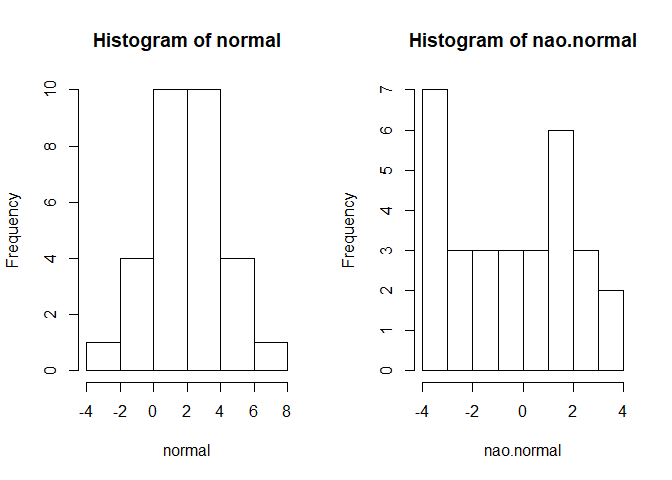

Estatística básica
================

A ideia desta seção é apresentar as funções do R que realizam as análises estatísticas básicas e testam pressupostos. E também como utilizar os resultados dentro do R para gerar gráficos com legendas.

Neste sentido, demostrarei com fazer Teste-T, Anova, Teste de Tukey, Teste de Correlação e Regressão Linear.

Teste T
-------

O teste T é conduzido no R com a função `t.test`.

Para exemplificar, vamos utilizar os dados de captura de CO2 da por *Echinochloa crus-galli* e comparar de acordo com a origem da planta.

``` r
# carregue os dados
data("CO2")
```

Antes de aplicar o teste T, devemos saber se há homegeneidade das variâncias. Para isso, aplicamos a função `leveneTest` do pacote `car`. É necessário informar apenas

``` r
library(car)
leveneTest(CO2$uptake ~ CO2$Type)
```

    ## Levene's Test for Homogeneity of Variance (center = median)
    ##       Df F value Pr(>F)
    ## group  1  0.1704 0.6808
    ##       82

No resultado acima `Pr(>F)` refere-se ao valor de p. Caso for significativo, abaixo de 0,05, consideramos que NÂO há homogeneidade das variâncias.

Como nossos dados poussem variâncias homogêneas, devemos incluir o argumento `var.equal = TRUE` na função `t.test`. Caso contrário, não há necessidade de informar o argumento `var.equal`

``` r
t <- t.test(CO2$uptake ~ CO2$Type, var.equal = TRUE)
t
```

    ## 
    ##  Two Sample t-test
    ## 
    ## data:  CO2$uptake by CO2$Type
    ## t = 6.5969, df = 82, p-value = 3.835e-09
    ## alternative hypothesis: true difference in means is not equal to 0
    ## 95 percent confidence interval:
    ##   8.84200 16.47705
    ## sample estimates:
    ##      mean in group Quebec mean in group Mississippi 
    ##                  33.54286                  20.88333

O teste nos mostrou que temos diferenças na captura de CO2 entre os locais. Vamos visualizar os dados com um boxplot. E adicionamos uma legenda para informar os resultados do teste T.

``` r
boxplot(CO2$uptake ~ CO2$Type)
```


Outro pressuposto é que os dados devem ter distribuição normal. Para analisar se os nossos dados têm distribuição normal podemos usar uma feramenta gráfica chamada `qqnorm`. Neste gráfico se os dados são de uma distribuição normal, os pontos ficarão alinhados sobre a linha dos 45º. abaixo temos dois exemplos com amostras de dados normais e não-normais

``` r
# Distrribuição normal
data<-rnorm(30, 2,2) 
qqnorm(data) 
qqline(data)
```



``` r
#Distribuição não-normal
data<-runif(30, -4,4) 
qqnorm(data) 
qqline(data)
```

 Podemos ainda testar a hypotese de os dados serem normais pelo teste de Shapiro-Wilk. Neste teste, esperamos que a hipotese nula seja confirmada, ou seja, o valor de p deve ser superior a 0,05.

``` r
quebec <- CO2$uptake[CO2$Type == "Quebec"]
mississippi <- CO2$uptake[CO2$Type == "Mississippi"]

shapiro.test(quebec)
```

    ## 
    ##  Shapiro-Wilk normality test
    ## 
    ## data:  quebec
    ## W = 0.85988, p-value = 0.0001111

``` r
shapiro.test(mississippi)
```

    ## 
    ##  Shapiro-Wilk normality test
    ## 
    ## data:  mississippi
    ## W = 0.93633, p-value = 0.0213

Nossos dados não seguem uma distribuição normal, e portanto não podemos confiar no resultado do teste-t, pois o pressuposto de normalidade dos dados não foi atendido.

Teste Wilcoxon-Mann-Whitney
---------------------------

Confiar no resultado de um teste paramétrico que não atente os pressupostos aumenta a nossa chance de cometermos erro do tipo I (afirmamos existir diferença quando ela não existe).

A opção não-paramétrica para amostras independentes é o teste de Wilcoxon-Mann-Whitney (função `wilcox.test`), onde não precisamos assumir que os dados possuem distribuição normal.

``` r
wilcox.test(uptake ~ Type, data = CO2)
```

    ## Warning in wilcox.test.default(x = c(16, 30.4, 34.8, 37.2, 35.3, 39.2,
    ## 39.7, : cannot compute exact p-value with ties

    ## 
    ##  Wilcoxon rank sum test with continuity correction
    ## 
    ## data:  uptake by Type
    ## W = 1489, p-value = 5.759e-08
    ## alternative hypothesis: true location shift is not equal to 0

O teste confirma que há diferenças entre na captura de CO2 entre as populações de Quebec e Mississippi.

ANOVA
-----

Enquanto o teste T verifica se há diferença da média de um parâmetro entre dois grupos, com a ANOVA podemos testar se há diferenças entre três ou mais grupos.

Para utilizar o teste ANOVA os dados devem ser de disribuição normal, com variancias homogêneas e as variáveis devem ser independentes.

Como exemplo
