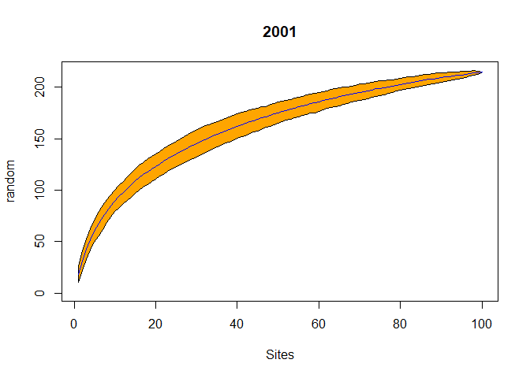

Fitossociologia
================

### Os dados

Para abordar as análises mais comuns em fitossociologia vamos utilizar os dados de ocorrência de espécies da Floresta do Seu Nico em 2001 e em 2010 que resultaram do [Desafio da Aula 2](Desafio_2.md).

Para isso nomeie os resultados como `seu.nico.2001` e `seu.nico.2010`.

Ou baixe os dois arquivos (Aqui: [2001](Seu_nico_2001.csv) e [2010](Seu_nico_2010.csv)) e carregue com o código abaixo:

``` r
seu.nico.2001 <- read.csv2("Seu_nico_2001.csv", row.names = 1)
seu.nico.2010 <- read.csv2("Seu_nico_2010.csv", row.names = 1)

str(seu.nico.2001)
```

    ## 'data.frame':    2482 obs. of  3 variables:
    ##  $ spp : Factor w/ 215 levels "","Alchornea glandulosa",..: 79 211 205 79 87 24 8 191 188 188 ...
    ##  $ parc: Factor w/ 100 levels "FSN_Plot_001",..: 1 1 1 1 1 1 1 1 1 1 ...
    ##  $ dap : num  0.2722 0.0891 0.0477 0.0462 0.2626 ...

``` r
str(seu.nico.2010)
```

    ## 'data.frame':    2529 obs. of  3 variables:
    ##  $ spp : Factor w/ 213 levels "","Alchornea glandulosa",..: 80 209 202 80 87 24 8 189 186 113 ...
    ##  $ parc: Factor w/ 100 levels "FSN_Plot_001",..: 1 1 1 1 1 1 1 1 1 1 ...
    ##  $ dap : num  0.2885 0.0608 0.0503 0.0541 0.2723 ...

### O que faremos?

Primeiro vamos analizar o contexto geral das amostragens, verificando se há sulficiência amostral e estimando a riqueza total da área.

Num segundo momento, iremos dividir as comunidades de 2001 e 2010 em dois componentes: a regeneração e os adultos. Com base nesses conjuntos de dados construiremos a tabela fitossociológica, exploraremos a diversidade e similaridade taxonômica entre os componentes e entre os anos 2001 e 2010

Sulficiência amostral
---------------------

Muitas das funções usadas em análises ecológicas estão disponíveis no pacote `vegan`, inclusive as que utilizaremos nesta seção.

Carregue o pacote `vegan`. Caso não tenha ele instalado no computador, instale e depois carregue o pacote.

    install.packages('vegan')

``` r
library(vegan)
```

    ## Loading required package: permute

    ## Loading required package: lattice

    ## This is vegan 2.4-2

Para atestar se a comunidade foi bem amostrada quanto ao número de espécies podemos gerar um gráfico de curva de acúmulo de espécies (ou curva do coletor). No `vegan`, isso é implementado com a função `specaccum`.

``` r
str(specaccum)
```

    ## function (comm, method = "exact", permutations = 100, conditioned = TRUE, 
    ##     gamma = "jack1", w = NULL, subset, ...)

Focaremos nos dois primeiros argumentos desta função (veja a ajuda da função para mais detalhes - `?specaccum`):

-   `comm`: é uma matriz da comunidade com parcelas nas linhas e espécies nas colunas
-   `method`: possui cinco métodos `"collector"`, `"random"`, `"exact"`, `"coleman"`, `"rarefaction"`
    -   `"exact"` encontra a riqueza de espécies esperada (média), `"coleman"` encontra a riqueza esperada de acordo com Coleman et al. 1982, e `"rarefaction"` que encontra a média acumuladada baseada no número de indivíduos ao invés de sítios.

Para criar uma matriz de espécies por parcelas utilizamos a função `table`.

``` r
floresta.2001 <- table(seu.nico.2001$parc, seu.nico.2001$spp)
floresta.2010 <- table(seu.nico.2010$parc, seu.nico.2010$spp)
```

Vamos gerar a curva de coletor para os dois anos

``` r
plot(specaccum(floresta.2001, "collector"), main = "2001")
```


``` r
plot(specaccum(floresta.2010, "collector"), main = "2010")
```


Há um problema em usar este tipo de curva, é que dependendo da ordem em que você adiciona as parcelas no gráfico você pode induzir que a curva fique estável.

Uma solução para este problema é criar uma curva que aleatorize a ordem de inclusão das parcelas para gerar uma média da riqueza e um desvio padrão a cada parcela inclusa.

Para isso alteramos o argumento `method` para `"random"`

``` r
plot(specaccum(floresta.2001, "random"), main = "2001")
```


``` r
plot(specaccum(floresta.2010, "random"), main = "2010")
```


Podemos ainda criar uma visualização mais interessante para os mesmos gráficos adicionando mais alguns argumentos à função `plot`

``` r
plot(specaccum(floresta.2001, "random"),main = "2001", col = "blue", ci.type = "polygon", ci.col = "orange")
```



``` r
plot(specaccum(floresta.2010, "random"),main = "2010", col = "blue", ci.type = "polygon", ci.col = "orange")
```


Riqueza de espécies
-------------------

Para ver qual a riqueza de espécies em cada ano de amostragem, basta contar quantas colunas o data frame possui.

``` r
ncol(floresta.2001)
```

    ## [1] 215

``` r
ncol(floresta.2010)
```

    ## [1] 213

Para ver quantas espécies temos em cada parcela a função `specnumber`

``` r
specnumber(floresta.2001)
specnumber(floresta.2010)
```

Para estimar quantas espécies as comunidades possuiam em 2001 e 2010 podemos usar duas funções diferentes `specpool` ou `poolaccum`.

A primeira função retorna apenas o número de espécies total estimado, enquanto com a função `poolaccum` podemos criar gráfico com modelos de acumulação com base em cada método de estimação.

Veja abaixo:

``` r
## Estimador de riqueza de espécies
pool2001 <- specpool(floresta.2001)
pool2010 <- specpool(floresta.2010)

pool2001
```

    ##     Species     chao  chao.se  jack1 jack1.se    jack2     boot  boot.se
    ## All     215 250.2054 12.53969 268.46 8.643229 281.6059 241.2845 5.254879
    ##       n
    ## All 100

``` r
pool2010
```

    ##     Species   chao  chao.se  jack1 jack1.se    jack2     boot  boot.se   n
    ## All     213 263.46 17.41318 270.42 9.408815 295.2467 239.7745 5.368732 100

``` r
## Modelos de Acumulação (estimadores)
pool <- poolaccum(floresta.2001)
plot(pool)
```


``` r
summary(pool, display = "jack2") # mostra os valores estimados com jacknife2
```

Tabela fitossociológica
-----------------------

Os muitos pacotes que o R possui fornecem uma imensa quantidade funções, porém, nem tudo que agente precisa está lá. As vezes, criamos uma sequência de códigos muito particular para o tipo de dados que estamos lidando, e precisamos automatizar a execução desses blocos de códigos, principalmente quando a rotina é muito extensa.

Para fazer a tabela fitossociológica vamos utilizar um script que contém uma função que constrói a tabela e outra que mede a similaridade entre duas comunidades.

Com essas funções criaremos a tabela fitossociológica para os anos de 2001 e 2010 na Fazenda Seu Nico, divididos em componente arbóreo e regeneração.

Na sequência compararemos a similaridade florística das comunidades entre os anos e entre os componentes.

\[Baixe o Script\] e abra com o R. No script há a descrição das funções, como utilizá-las e como os dados devem estar tabelados para que a função funcione. Carregue as funções, como descrito no Script.

Em resumo, precisamos de uma tabela da comunidade onde as linhas são as obervações (indivíduos) e no mínimo três colunas, `parc`, `spp`, `cap` ou `dap`. Acrescente mais colunas se tiver caules multiplos, como `cap1` `cap2` `cap3`ou `dap1` `dap2` `dap3`.

Os dados da Floresta Seu Nico já estão neste formato, só nos resta separá-las em componetes regeneração e arbóreo. Para isso fazemos um filtro onde os indivíduos com `dap` &lt; 10 cm pertencem ao componente regeneração. Usamos a função `filter`do pacote `dplyr` para isso:

``` r
library(dplyr)
```

    ## Warning: Installed Rcpp (0.12.10) different from Rcpp used to build dplyr (0.12.11).
    ## Please reinstall dplyr to avoid random crashes or undefined behavior.

    ## 
    ## Attaching package: 'dplyr'

    ## The following objects are masked from 'package:stats':
    ## 
    ##     filter, lag

    ## The following objects are masked from 'package:base':
    ## 
    ##     intersect, setdiff, setequal, union

``` r
str(seu.nico.2001)
```

    ## 'data.frame':    2482 obs. of  3 variables:
    ##  $ spp : Factor w/ 215 levels "","Alchornea glandulosa",..: 79 211 205 79 87 24 8 191 188 188 ...
    ##  $ parc: Factor w/ 100 levels "FSN_Plot_001",..: 1 1 1 1 1 1 1 1 1 1 ...
    ##  $ dap : num  0.2722 0.0891 0.0477 0.0462 0.2626 ...

``` r
seu.nico.2001.reg <- filter(seu.nico.2001, dap < 10)
seu.nico.2010.reg <- filter(seu.nico.2010, dap < 10)

seu.nico.2001.arb <- filter(seu.nico.2001, dap >= 10)
seu.nico.2010.arb <- filter(seu.nico.2010, dap >= 10)
```

Pronto, dividimos as amostragens em componentes de regeneração e arbóreo.

Agora, com esses objetos em mãos, sua tarefa é utilizar as funções `fitoR` e `similaridade` para criar tabelas fitossociológicas e comparar as comuminidades para entender um pouco da dinâmica florestal na Floresta Seu Nico.
