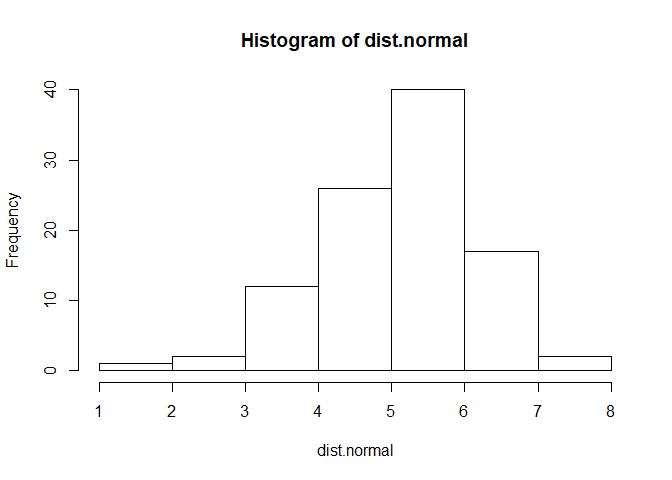
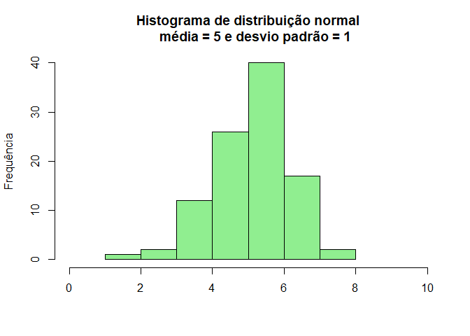
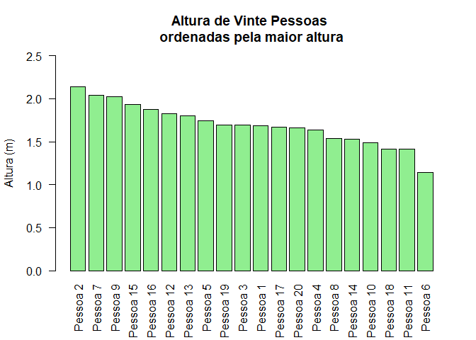
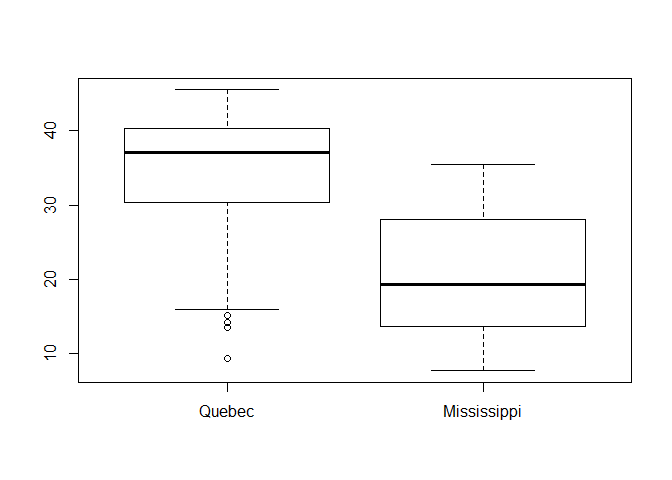

Gráficos
================

> -   Histograma
> -   Barras
> -   Boxplot
> -   Pontos

Histogramas
===========

Um histograma apresenta a frequência com que uma classe de valor ocorre em um grupo de dados.

Como exemplo, vamos criar um vetor com dados de distribuição normal aleatório, usando a função `rnorm`. Como se trata de valores aleatórios usamos a função `set.seed` para fixar os valores aleatórios gerados pela função `rnorm`, assim você conseguirá gerar os mesmos valores aleatórios que utilizarei para gerar os gráficos.

Por fim utilize a função `hist` para gerar o gráfico:

``` r
set.seed(125)
dist.normal <- rnorm(100, mean = 5, sd = 1)
hist(dist.normal)
```



Este foi o gráfico com as opções default, podemos aprimorar a visualização de acordo com nossas preferências. Abaixo reeditei o gráfico para mostrar alguns argumentos função `hist`

``` r
hist(dist.normal, main = "Histograma de distribuição normal
    média = 5 e desvio padrão = 1", xlim = c(0,10),
    xlab = "", ylab = "Frequência", col = "lightgreen")
```



Barras
======

Para criar um gráfico de barras utilizamos a função `barplot`.

Antes vou criar um objeto com vinte valores de média 1,7 e desvio padrão 0,3 e nomear os valores para representar pessoas de diferentes alturas.

``` r
altura <- rnorm (20, mean = 1.70, sd = 0.30 )
names(altura) <- paste("Pessoa", 1:20)

barplot(altura, las = 2)
```


> Altere o argumento `las` entre 0 e 3 para entender que parametro gráfico ele está controlando.

Neste exemplo desejo mostrar as alturas das pessoas ordenadas da maior para a menor altura, ou seja, de modo decrescente. Então criamos um objeto com os valores ordenados:

``` r
altura.order <- altura[order(altura, decreasing = TRUE)]
```

E na sequência criamos um novo gráfico, um pouco mais elaborado, para mostrar alguns argumentos sendo utilizados.

``` r
barplot(altura.order, main = "Altura de Vinte Pessoas 
ordenadas pela maior altura", las = 2, col = "lightgreen", 
        ylim = c(0, 2.5), ylab = "Altura (m)")
```



Boxplot
=======

Este tipo de gráfico é útil para comparar valores entre dois ou mais grupos. Uma maneira boa de apresentar testes estatísticos de comparação de médias como ANOVA, por exemplo.

Para este exemplo vamos carregar os dados de captura de CO2 por *Echinochloa crus-galli*. Esses dados estão disponíveis na função `data`, uma função que contém diversos outros dados que podem ser usados facilmente. Para uma lista completa desses bancos de dados execute o comando `data()`.

Visualise os dados com a função `View`.

``` r
data(CO2)
View(CO2)
```

Agora criamos os gráficos com a função `boxplot`.

O primeiro argumento desta função é chamado de fórmula, neste caso funciona assim: `boxplot(valores ~ grupos)`, onde os grupos precisam ser um vetor do tipo fator (*factor*)

``` r
boxplot(CO2$uptake ~ CO2$Type)
```



``` r
boxplot(CO2$conc ~ CO2$Type)
```


### Função Par

Acho que fica mais interessante e informativo agrupar os dois gráficos em uma só imagem. Para isso usamos a função `par`. Essa é uma função que configura parametros gráficos no R. Ela possui uma lista extensa de argumentos que podem ser utilizados para configurar os mais variados parâmetros de um gráfico. Veja a ajuda de `par`.

Antes vamos salvar a configuração padrão da função, e depois usar o argumento `mfrow = c(1, 2)` para obter gráficos ordenados em uma linha e duas colunas

``` r
defaltpar <- par()
par(mfrow = c(1, 2))

boxplot(CO2$uptake ~ CO2$Type, main = "Captura de CO2", 
        col = c("lightblue", "salmon"))
boxplot(CO2$conc ~ CO2$Type, main = "Concentração de CO2",
        col = c("lightblue", "salmon"))
```


Então voltamos a função `par` para a configuração original.

``` r
par(defaltpar)
```

Gráfico de pontos
=================

Agora utilizaremos os dados `iris` para gerar gráficos de pontos. `iris` possui valores de comprimento e largura de pétalas e sépalas para três espécies do gênero *Iris*.

``` r
data("iris")
View(iris)
```

Usamos a função plot com os valores que desejamos no eixo x e no eixo y do gráfico, dessa forma: `plot(x,y)`.

Um exemplo com os dados `iris`

``` r
plot(iris$Petal.Length, iris$Petal.Width)
```


Abaixo uma versão do gráfico que colore as espécies e adiciona diferentes tipos de pontos a elas.

``` r
plot(iris$Petal.Length, iris$Petal.Width, 
     col = iris$Species, pch = c(5,8,9)[iris$Species], las = 1,
     main = "Comprimento e largura das pétalas 
     de espécies do genero Iris", xlab = "Comprimento da pétala (cm)", 
     ylab = "Largura da pétala")
```


