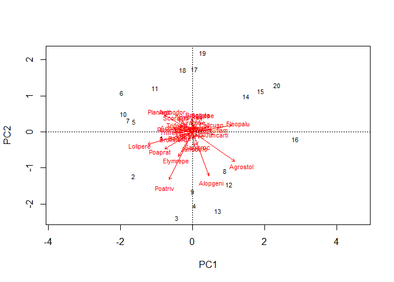
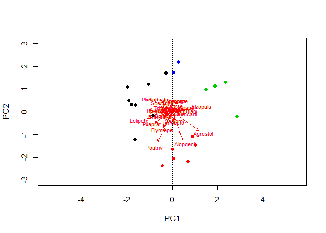
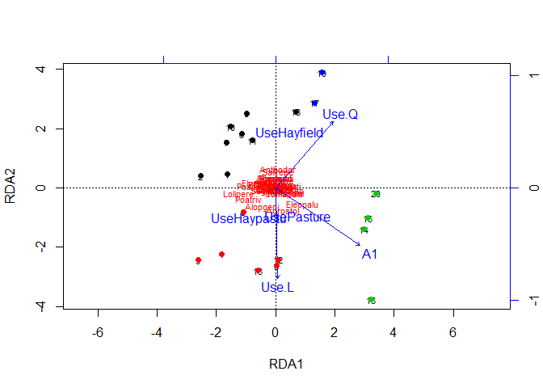

Ordenação
================

O objetivo central nas análises de ordenação é reduzir a multidimensinalidade dos dados para poucas dimensões, de preferência duas ou três para que possam ser graficamente representadas.

Consideramos que cada variável descritora representa uma dimensão da variação entre os objetos. Portanto, se estamos comparando comunidadades que são descritas pelas espécies, cada espécie representa uma dimensão na análise.

As análises, então, reduzem a informação total para um numero menor de dimensões. Assim podemos visualizar os objetos em um gráfico para analisar o gradiente de variação entre os objetos.

Aqui vamos dar uma olhada em como realizar algumas dessas analises de ordenação no R. Iremos conduzir:

-   Análise dos Componentes Princiais (PCA)
-   Análise de Redundância (RDA)
-   Escalonamento Multidimensional Não-Métrico (NMDS)

Análise de Componentes Princiais (PCA)
--------------------------------------

Vamos continuar utilizando os dados de `dune` que usamos na [análise de agrupamento](https://avrodrigues.github.io/An%C3%A1lise_de_Agrupamento.html).

Vamos utilizar o pacote `vegan` para realizar as ordenações desta seção, portanto, carregue a biblioteca `vegan`.

Utilizaremos a função `rda`. Esta função roda uma PCA quando adicionamos apenas uma matriz como argumento.

``` r
library(vegan)
#PCA
data("dune")

pca <- rda(dune)
pca.res <- summary(pca)
```

Criamos um objeto (`pca.res`) com o resumo do resultado da PCA. Ao chamar esse objeto você verá uma extensa lista de resultados. Criei o objeto para demostrar como acessar cada resuldado diretamente.

Esse objeto é do tipo lista, então podemos acessar o conteúdo de cada lista com o seletor tipo `$` e o nome da lista.

Para ver a procentagem de explicação dos eixos:

``` r
pca.res$cont
```

    ## Importance of components:
    ##                           PC1     PC2     PC3     PC4    PC5     PC6
    ## Eigenvalue            24.7953 18.1466 7.62913 7.15277 5.6950 4.33331
    ## Proportion Explained   0.2948  0.2157 0.09069 0.08503 0.0677 0.05151
    ## Cumulative Proportion  0.2948  0.5105 0.60115 0.68618 0.7539 0.80539
    ##                           PC7     PC8    PC9    PC10    PC11    PC12
    ## Eigenvalue            3.19936 2.78186 2.4820 1.85377 1.74712 1.31358
    ## Proportion Explained  0.03803 0.03307 0.0295 0.02204 0.02077 0.01561
    ## Cumulative Proportion 0.84342 0.87649 0.9060 0.92803 0.94880 0.96441
    ##                          PC13    PC14    PC15    PC16    PC17    PC18
    ## Eigenvalue            0.99051 0.63779 0.55083 0.35058 0.19956 0.14880
    ## Proportion Explained  0.01177 0.00758 0.00655 0.00417 0.00237 0.00177
    ## Cumulative Proportion 0.97619 0.98377 0.99032 0.99448 0.99686 0.99862
    ##                          PC19
    ## Eigenvalue            0.11575
    ## Proportion Explained  0.00138
    ## Cumulative Proportion 1.00000

Na linha `Proportion Explained` podemos ver que os componentes principais 1 e 2 (PC1 e PC2) explicam 29,48% e 21,57%. Na linha de baixo (`Cumulative Proportion`) podemos ver que os dois componentes principais explicam 51,05% da variação total de espécies entre os sítios.

Para o gráfico da PCA usamos a função `biplot`.

``` r
biplot(pca)
```



Quando analisamos os dados com objetivo de classificar os sítios identificamos 4 grupos. Vamos utilizar essse agrupamento para colorir os pontos de acordo com o grupo a que o sítio pertence.

Para isso, vamos recuperar o pertencimento a cada grupo do objeto `spe.euc.WPGMA` com a função `cutree`.

``` r
## pertencimento de cada parcela a um grupo
spe <- dune
spe.euc <- vegdist(spe, method = "euclidean")
spe.euc.WPGMA <- hclust(spe.euc , method="mcquitty")

gr <- cutree(spe.euc.WPGMA, k=4)

# PCA
pca <- rda(dune)
biplot(pca, display = "species", ylim = c(-3, 3), xlim = c(-2, 2))
points(pca, col = gr, pch = 16)
```



Quando usamos um objeto do tipo `rda` na função `biplot` podemos escolher plotar aprenas os sítios ou as espécies que descrevem os sítios. Para isso, usamos o argumento `display = "species"` ou `display = "sites"`. Como a escolhemos mostrar apenas as espécies na função `biplot`, configuramos os argumentos `xlim` e `ylim` para fixar os limites dos eixos x e y de maneira que todos os pontos (adicionados com a função `points`) ficassem acondicionados dentro do gráfico.

Na função `points` o argumento `col` coloriu cada ponto de acordo com o grupo e o argumento `pch` foi utilizado para escolher o símbolo para cada ponto.

Análise de redundância (RDA)
============================

Com a PCA conseguimos observar a ordenação dos sítios com base nas espécies presentes em cada um.

Mas será que a alteração das espécies entre as parcelas é devida à alteração do ambiente entre as parcelas?

Este tipo de pergunta pode ser respondida com a RDA. Nela informamos duas matrizes, uma que descreve os sítios com base nas espécies e outra que descreve os sítios com base em características ambientais.

A RDA então retorna como as características ambientais estão correlacionadas com os eixos da PCA que foram usadas para ordenar os sítios. Interpretamos que as variáveis ambientais que estão correlacionadas com os componentes principais são as variáveis que devem estar melhor explicando a variação entre as comunidades. Dessa maneira identificamos as variáveis ambientais que estão influenciando a variação das espécies entre os sítios.

Para a RDA precisamos de duas matrizes que descrevem os sítios. Uma delas, decreve os sítios com base nas espécies. A outra matriz decreve os sítios com base nas variáveis ambientais.

Para exemplificar vamos usar como matriz de espécies os dados de `dune` e a matriz ambiental será `dune.env`.

``` r
data("dune.env")

str(dune.env)
```

    ## 'data.frame':    20 obs. of  5 variables:
    ##  $ A1        : num  2.8 3.5 4.3 4.2 6.3 4.3 2.8 4.2 3.7 3.3 ...
    ##  $ Moisture  : Ord.factor w/ 4 levels "1"<"2"<"4"<"5": 1 1 2 2 1 1 1 4 3 2 ...
    ##  $ Management: Factor w/ 4 levels "BF","HF","NM",..: 4 1 4 4 2 2 2 2 2 1 ...
    ##  $ Use       : Ord.factor w/ 3 levels "Hayfield"<"Haypastu"<..: 2 2 2 2 1 2 3 3 1 1 ...
    ##  $ Manure    : Ord.factor w/ 5 levels "0"<"1"<"2"<"3"<..: 5 3 5 5 3 3 4 4 2 2 ...

Vamos analisar a espessura do horizonte do solo `A1` e o tipo de uso (`Use`) tinham influência na separação dos grupos

``` r
dune.moisture <- rda(dune ~ A1 + Use, data = dune.env)
plot(dune.moisture)
points(dune.moisture, col = gr, pch = 16)
```


